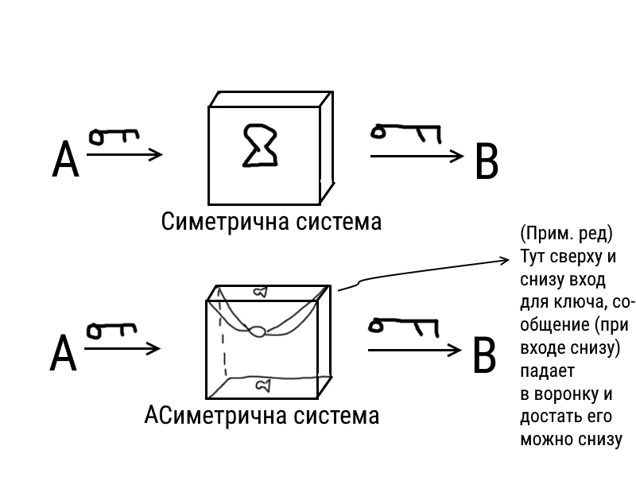
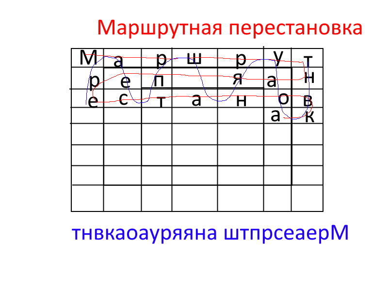
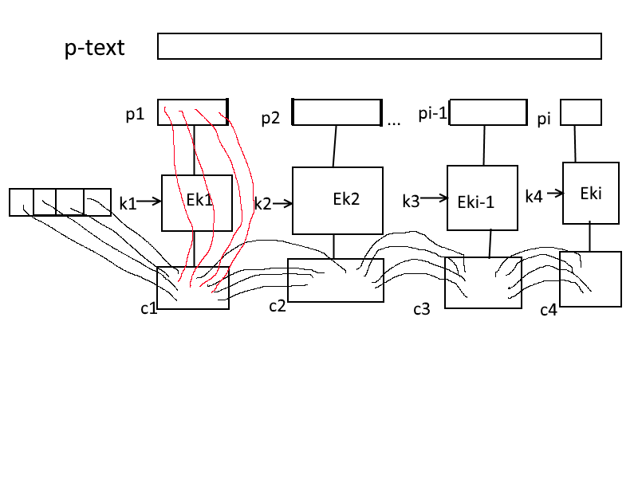
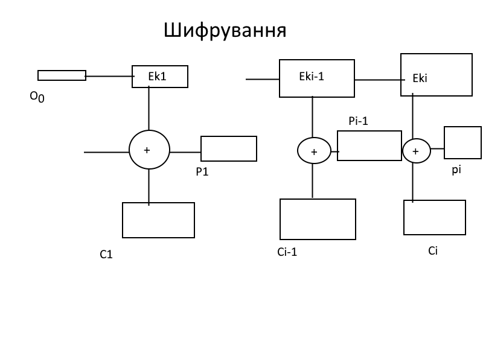

#Лекции по комп. безопастности
<ul>
<li><a href="#Лекц1">Лекция 1</a></li>
<li><a href="#Лекц2">Лекция 2</a></li>
<li><a href="#Лекц3">Лекция 3</a></li>
<li><a href="#Лекц4">Лекция 4</a></li>
<li><a href="#Лекц5">Лекция 5</a></li>
<li><a href="#Лекц6">Лекция 6</a></li>
<li><a href="#Лекц7">Лекция 7</a></li>
<li><a href="#Лекц8">Лекция 8</a></li>
<li><a href="#Лекц9">Лекция 9 + 10</a></li>
<li><a href="#Лекц11">Лекция 11</a></li>
<li><a href="#Лекц12">Лекция 12</a></li>
</ul>
#Лекц1
##Короткі відомості
####1.Common language runtime (CLR)
####2.Сбірки дотнету
####3.Структура збірки
####4.Перегляд вмісту збірок
####5.Атрибути збірок

1)Компіляція

```
+ Оптимізація для процесора
+ Взаємодія компонентів (COM/DCOM)
- Моноплатформність
- Нестабільність
- Незахищеність ОС
- Крах DLL
```
2)Інтерпретація
```
+ Багатоплатформність
+ Стабільність
+ Захищеність
+ Спрощення розгортання
+ Оптимізація під процесор
+ Взаємодія компонентів
```


#Лекц2
Збірка - одиниця в дотнет. Можем буду в .ехе(містять точку входа), .dll


а) Найпростіший варіант створення збірок у вигляді одного файлу


###ІІІ. Перегляд структури збірок
ildasm.exe - утиліта для "декомпіляції"
ilasm.exe - утиліта для компіляції IL-коду

###Перегляд збірки:
1) Ввести в команднії стрічці >ildasm.exe (Файл-Откріть)
2) Ввести в команднії стрічці >ildasm.exe <path>

для компіляції (створення збірки) в c# можна застосувати csc.exe
```
>csc /target:exe Hello.cs /out:hello.exe
             win.exe
             library (dll)
             module
```
для перегляду усіх команд можна використати:
```
>csc /?
```
Для створення модуля, можна використати таку команду:
```
>csc /target:module Module1.cs /out:Module1.netmodule
```
Для створення нових збірок, використовуючи готові модулі
```
>csc /target:exe /addModule:Module1.netmodule /out:hello.exe
```
Розділяють збірки на декілька файлів для створення программ з обмеженим функціоналом

###ІV. Використання збірок

Атрибути збірок можуть задаватись в файлі Assemblyinfo.cs, в якому можна задавати
цілий ряд додаткових параметрів збірок:
`Assembly Company - назва компанії`
`Assembly Copyright - інформація про авторів`
`Assembly Description - опис збірок`
`Assembly Version і т.д.`


###I. Структура програми
###II. Визначення збірки і посилань на збірки, що розділяються
###ІІІ. Визов методів
###ІV. Визначення просторів імен, класів і ...
###V. Визначення полів, конструкторів і властивостей класів

Як пишуться додатки, стуктура найпростішої програми:
Директиви (пишуться з крапки) - .method
За директивою можуть слідувати атрибути - .method static void
Потім ім'я методу - .method static void FirstPogram() {}
Далі вказуються деякі інструкції (тіло методу), але для компіляції головне
вказати ім'я збірки (посилання), яке може мати додаткові директиви
```
.assembly MyAssemble {

}
.method static void FirstProgram() {
    ret //вихід з файлу
}
```
Для .ехе файлів треба помітити точку входу за допомогою директиви .entrypoint
```
.assembly MyAssemble {

}
.method static void FirstProgram() {
    .entrypoint
    ret
}
```
Вказання посилань на зовнішні збірки, використовуються "дружні" імена
```
.assembly extern mscorlib{
    .ver 2:0:1:1
    .publickeytoken =  (11 B2 D4 F5 7D 99 FF)
}
.assembly MyAssemble {
    .ver 1:0:0:0
}
.method static void FirstProgram() {
    call [mscorlib]System.Console::Bepp()
    call [mscorlib]System.Console::ReadLine()
    .entrypoint
    ret
}
```
Визначення простору імен класів та функцій

Для створення простору імен використовується директива .namespace

a) .net 2.0 <
```
.namespace FirstSpace {
    .namespace  SecondSpace {
        .class BaseClass {

        }
    }
}
```
b) .net 2.0 >=
```
.class FirstSpace.SecondSpace.BaseClass {

}
.namespace FirstSpace {
    .namespace SecondSpace {
        .class BaseClass {}
        .class DerivedClass extends FirstSpace.SecondSpace.BaseClass {}
    }
}
```
#Лекц3

Для створення інтерфейсу директиви не існує. Треба створювати класс з атрибутом інтерфейсу:
```
.class interface IMyInterface {}
//--//extends//--//implements
.namespace FirstSpace {
    .class interface IMyInterface {/*impl*/}
    .class MyClass implements FirstSpace.IMyInterface {}
}
```
Переконались, що namespace "НЕ ІСНУЄ", але існують класи
```
.assembly MyAssembly {}
.namespace MyNamespace{
    .class Program {
        .method public static void main() {
            .entrypoint
            call string  [mscorlib]System.Console::ReadLine()
            pop
            call void  MyNamespace.Program::Voice()
            ret
        }
        .method static void Voice() {
            call void [mscorlib]System.Console::Beep()
            ret
        }
    }
}
```
```
.assembly MyAssembly {}
.method public static void main() {
    .entrypoint
    call string  [mscorlib]System.Console::ReadLine()
    pop
    call void  Voice()
    ret
}
.method static void Voice() {
    call void [mscorlib]System.Console::Beep()
    ret
}
```
:::::::::::::::::::::::::::::::::::::::::::::::::::::::::::::::::::::::::
```
.assembly MyAssembly {}
.class BaseClass {
    .method void Voice {
        call void [mscorlib]System.Console::Beep()
        ret
    }
}
.class interface IPause() {
    .method void Pause() {}
}
.class DerivedClass extends BaseClass implements IPause {
    .method static void Pause {
        call string [mscorlib] System.Console::ReadLine()
        pop
        ret
    }
}
.method static void Main() {
    call void DerivedClass::Pause()
    call void DerivedClass::Voice()
}
```


Статичний конструктор
```
.assembly MyAssembly {}
.class Program {
    .method static void .cctor() {
        call void [mscorlib]System.Console::Clear()
        ret
    }
    .method static void Main() {
        call string [mscorlib]System.Console::ReadLine()
        pop
        ret
        .entrypoint
    }
}
```
Конструктор екземпляру
```
class Instance {
    .method instance void .ctor() {
        .maxstack 1
        ldarg.0
        call instance void [mscorlib]System.Object::ctro()
        ldstr "Constructor was run!"
        call void [mscorlib]System.Console::WriteLine(string)
        ret
    }
    .field public string name
}

.method static void Main(){
    .entrypoint
    .locals init (class Instance obj)
    newobj instance void Instance::.ctor()
    ldstr "pupkin"
    stfld string Instance::name
    ldfld string Instance::name
    call void [mscrorlib]System.Console::WriteLine(string)
    ret
}
```
::::::::::::::::::::::::::::::::::::::::::::::::::::::::::::::::::::
```
class Instance {
    .method instance void .ctor() {
        .maxstack 1
        ldarg.0
        call instance void [mscorlib]System.Object::ctro()
        ldstr "Constructor was run!"
        call void [mscorlib]System.Console::WriteLine(string)
        ret
    }
    .field public string name
}

.method static void Print(){
    ldarg.0
    ldfld string Instance::name
    ldstr "name="
    call void [mscrorlib]System.Console::WriteLine(string)
    call void [mscrorlib]System.Console::WriteLine(string)
    ret
}
```
#Лекц4

Пр 9
```
.method static void Main() {
    .locals (class Instance obj)
    newobj instance void Instance::ctor()
    stloc obj
    ldloc obj
    ldstr "pmpkin"
    stfld string Instance::name
    ldloc obj
    ldfld string Instance::name
    call instance void Instance::Print()
    ret
    .entrypoint
}
```
для доступу до полів можна використовувати властивості

Оголошення властивостей
```
.field private <type> <field.name>
.property instance public <Field_name> {
    .get instance <type> <ClassName>::get_<Field_name>
    .set instance void <ClassName>::set_<Field_name>
}

.method instance <type> <ClassName>::get_<Field_name>() {

}

.method instance void <ClassName>::set_<Field_name>(<type>) {
/*impl*/
}

call <type> <ClassName>::get_<Field_name>()
call void <ClassName>::set_<Field_name>(<type>)
```
```
┌────────────────────┬────────────┬──────────────┬──────────────────────────────┐
│  .Net              │    C#      │   IL         │         Конс нотація IL      │
├────────────────────┼────────────┼──────────────┼──────────────────────────────┤
│  System.Single     │    float   │   float32    │          r4                  │
│  System.Double     │    double  │   float64    │          r8                  │
│  System.Char       │    char    │   char       │          char                │
│  System.Boolean    │    bool    │   bool       │          boolean             │
│  System.String     │    string  │   string     │           ─                  │
│  System.Void       │    void    │   void       │          void                │
└────────────────────┼────────────┼──────────────┼──────────────────────────────┘
```
```
.assembly MyAssembly() {
    .method static void Main() {
        .locals init(int8 a,
                     int16 b,
                     int32 c,
                     int64 d,
                     float32 -1.2,
                     float64 3.14,
                     char chr,
                     string str)
        ldc.i4.s 16
        stloc a
        ldloc a
        call void [mscorlib]System.Console::WriteLine(int32)
    }
}
```
#Лекц5


ldc - завантаж. конст
ldc.i4 10

ldstr 0 - занесення текстового рядка
ldstr "Hello"

ldloc - завантаження локальних аргументів
ldarg - завантаження локальних аргументів методів
ldfld - завантаження локальних полів

ldc.i4.0 ... ldc.i4.8
ldloc.0 ... ldloc.8

stloc - зберегти локальні змінні
starg - зберегти локальні аргументи методів
stfld - зберегти локальні поля

pop - очищення вершини стеку

Приклад 1
```
.assembly MyAssembly {}
.method static void Main() {
    ldstr "One"
    ldstr "Two"
    ldstr "Three"
    call void [mscorlib]System.Console::WriteLine(string)
    call void [mscorlib]System.Console::WriteLine(string)
    call void [mscorlib]System.Console::WriteLine(string)
    ret
    .entrypoint
}
```
Приклад 2
```
.assembly MyAssembly {}
.method static void Main() {
    .entrypoint
    .maxstack 2
    ldstr "Enter number:"
    call void [mscorlib]System.Console::WriteLine(string)
    call string [mscorlib]System.Console::ReadLine()
    call int32 [mscorlib]System.Int32::Parse(string)
    ldstr "You enter:"
    call void [mscorlib]System.Console::WriteLine(string)
    call void [mscorlib]System.Console::WriteLine(string)
    ret
}
```
Способи задання локальних змінних

1) .locals init(type <name>, ...)
    ldloc <name?
2) .localc init([0]type<name1>,
                [1]type<name2>, ...)
    ldloc.0 ... ldloc.3 ... ldloc.9

###Операції:
-1) Арифметичні: add(+), sub(-), mul(*), div(/), rem(%)
-2) Порівняння: ceq(=), clt(<), cgt(>)
-3) Переходу на мітку: btrue <label>, bfalse <label>, br<label
    beq(=), blt(<), ble(<=), bge(>)
-4) Упаковка даних:
    box type
    unbox type
```
WriteLine(string, object, object, ...)
WriteLine("x={0}", )

.locals init (int32, int32)
ldc.i4.1
stloc.0
ldc.i4.2
stloc.1
ldloc.0
ldloc.1
ceq
btrue _label
_label:
```
#Лекц6
...
Пропущено пол часа пары
...
if, switch
for, while, foreach - в CIL не существуют!
>"Они придуманы массонами!" - заявил Юрий Адамович

Реалізація умовного оператора if

Пр.2
```
.assembly MyAssembly {}
.method static void Main() {
    .maxstack 2
    .entrypoint
    .locals init(int32 x)
    ldc.i4 15 //x
    stloc x
    ldloc x
    ldc.i4 2
    rem
    ldc.i4 0
    ceq
    bfalse _odd //или 0dd
    ldstr "{0} - Even"
    ldloc x
    box int32
    call void [mscorlib]System.Console::WriteLine(string, object)
    ret

    _odd:
    ldstr "{0} - Odd"
    ldloc x
    box int32
    call void [mscorlib]System.Console::WriteLine(string, object)
    ret
}
```
Реалізація умовного оператора switch

Пр.3
```
.assembly MyAssembly {}
.method static void Main() {
    .maxstack 1
    .entrypoint
    .locals init(int32 x)
    ldc.i4 1 //x
    switch(_0, _1, _2)
    _0:
        ldstr "Case 0"
        call void [mscorlib]System.Console::WriteLine(string, object)
        ret
    _1:
        ldstr "Case 1"
        call void [mscorlib]System.Console::WriteLine(string, object)
        ret
    _2:
        ldstr "Case 2"
        call void [mscorlib]System.Console::WriteLine(string, object)
        ret
    ret
}
```
Реалізація оператора циклу for
```
int sum = 0;
for(int i = 1; i <= 5; i++)
    sum += i;
```
Пр.4
```
.assembly MyAssembly {}
.method static void Main() {
    .maxstack 1
    .entrypoint
    .locals init(int32 i, int32 sum)
    _Inicializaton:
        ldc.i4 1
        stloc i
    _Condition:
        ldloc i
        ldc.i4 5
        blt _Loop
        br _Exit
    _Loop:
        ldloc sum
        ldloc i
        add
        stloc summ
    _Incrementation:
        ldloc i
        ldloc.i4 1
        add
        stloc i
        br _Condition
    _Exit:
        ret
}
```
Реалізація оператору циклу while
```
int sum = 0;
int i = 1;
while(i <= 5) {
    sum += i;
    i++;
}
```
Пр.5
```
.assembly MyAssembly {}
.method static void Main() {
    .maxstack 1
    .entrypoint
    .locals init(int32 i, int32 sum)
    _Inicializaton:
        ldc.i4 1
        stloc i
    _Condition:
        ldloc i
        ldc.i4 5
        ble _Loop
        br _Exit
    _Loop:
        ldloc sum
        ldloc i
        add
        stloc summ
        ldloc i
        ldloc.i4 1
        add
        stloc i
        br _Condition
    _Exit:
        ret
}
```
Массиви створюються за допомогою команди new arr[], назви змінної та ініціалізації

Реалізація оператору циклу foreach
```
int[] numbers = {5,10,15}
foreach(int i in numbers)
    Console.WriteLine(i);
```
Пр.6
```
.assembly MyAssembly {}
.method static void Main() {
    .maxstack 1
    .entrypoint
    .locals init(int32[] numbers, int32 i)
    ldc.i4 3
    newarr int32
    stloc numbers

    //Присв значень
    ldloc numbers
    ldc.i4 2
    ldc.i4 15
    stelem.i4

    ldloc numbers
    ldc.i4 1
    ldc.i4 10
    stelem.i4

    ldloc numbers
    ldc.i4 0
    ldc.i4 5
    stelem.i4

    _Condition:
    ldloc numbers
    ldloc i
    ldlen
    bel _Loop
    br _Exit

    _Loop:
    ldloc i
    ldc.i4 1
    add
    ldloc numbers
    ldloc i
    ldelem.i4
    call void [mscorlib]System.Console::WriteLine(int32)
    br _Condition

    _Exit:
    ret
}
```
#Лекц7


Технології ЗПП:
```
- "Водяні знаки"
- Відбиток пальців
- Перевірка цілістності
- "Клієнт-сервер"
- DRM
```

Унеможливлення декомпіляції

1. Додання атрибутів
```
using System;
using System.Runtaime.CompilerServices;
[assembly: SuppressILdasmAttribute()]
class Program() {
    ...
}
```
2. редагування Assemblyinfo.cs
```
[assembly: SupressILdasm]
```

#Лекц8
Крипография

Литература:
<ul>
<li>1. Смарт Н. "Криптография" 2005 - 528с.</li>
<li>2. Вендо Мао "Современная криптография" 2002 - 728с.</li>
<li>3. XF "Основы Криптологии" 2006 - 571с</li>
<li>4. Саломаа А. "Криптография с открытым ключем" 1995 - 768с.</li>
<li>5. Каутинхо С. "Введение в теорию чисел, алгоритмы RSA" 2001 - 368c.</li>
</ul>

Модель симметричної криптосистеми
<ul>
<li>І. Криптографія і ії основні пункти</li>
<li>ІІ. Модель Шеннона криптографічної системи</li>
<li>ІІІ. Принцип Керкхоффса</li>
<li>IV. Фізична оцінка верхньої границі ключа</li>
</ul>


###Шифр Цезаря


```
c:\> cezar.exe -e filenametxt -key
```
Вимога до форми лабораторної


Симетричні та десиметричні методи шифрування


#Лекц9

Шеннон у 1947 р. виклав таку криптографічну систему:
Від Аліси до Боба передається шифроване повідомлення, Боб отримує і розшифровує повідомлення

Ключ - дані для шифрування/розшифрування
Шифр - сукупність алгоритмів шифрування і розшифрування


>"Принцип Керкхоффса - єдиним секретом повинен бути ключ, алгоритм повинен бути відкритим"

Тарнавский умножил Температуру солнца на мощность солнца и на время существования солнца и на k=1,4*10^-23
```
E=P*t = 3,86*10^26 * 3*10^17 = 10^44
kT = 1,4*10^-27 * 10^6 = 1,4*10^-17
N = E/(kT) = 10^44 * 3*10^-17 = 10^60
```
получил n = 60 - таких размеров ключ невозможно физически перебрать


В классической криптографии есть только два способа зашифровать сообщение:
заменить символ и поменять местами символы
Перестановочные шифры:
<ul>
<li>Маршрутная перестановка</li>
<li>Матричный перестановка</li>
<li>Стовпчикова/рядкова перестановка</li>
</ul>

Шифры замены:
<ul>
<li>Простая замена</li>
<li>Сложная замена</li>
<li>Блочная замена</li>
<li>Полиалфавитная замена</li>
</ul>

###1)Маршрутна перестановка

###2)Стовпчикова/рядкова перестановка

###3)Матрична перестановка

###4)Проста заміна


Усі способи, які були вказані вище, можна взламати за допомогою частотного методу.
Полягає у тому, що для даного алфавіту є статистика використання кожного символу і
якщо побудувати таку діаграмму (малюнок знизу) для шифрованого тексту, то будемо
мати аналогічну картинку (малюнок під малюнком).


###Поліалфавітна заміна:
Використовується проста заміна, проте кожен символ шифрується спочатку алфавітом-1,
потім алфавітом-2... алфавітом-N.


###Шифр Віженера:

Взлом шифру: якщо кожен символ взяти за одиницю, то шифрування має таку формулу:
c = (p + g) mod N; для шифр
p = (c - g + N) mod N; для дешифр

###Модифікованний шифр Цезаря:
desk_desk -> переводимо у порядковий номер у алфавіту
23...
gammagam -> переводимо у порядковий номер у алфавіту
51...
------------------
74... -> переводимо у порядковий номер у алфавіту
gd

Криптографічна стійкість - здастність алгоритмам протистояти атакам. Алгоритм вважається
стійким, якщо дешифрування вимагає:
1) неймовірну кількість ресурсів
2) такої кількості часу, після якої зашифрована інформація стає неактуальною
Тобто їх не існує.
Стійкість алгоритма може бути тількі спростована.
Шеннон: ... немає ніяких гарантій, що дешифрування було 100% правильним.

W N A J W

R I V E R (5)

A R E N A (25)

В результаті шифрування читабельного тексту, може бути створенний деяікий криптотекст.
Проте при дешифруванні можлива ситуація, коли можемо отримати декілька читабельних дешифрованних варіанті,
що не дає гарантій того, чи правильно ми зашифрували текст.

###Ознаки абсолютної криптостійкості:
```
1. Довжина ключа має бути не менше довжини повідомлення
2. Ключ має використуватисть лише один раз
3. Ключ має бути статистично надійним
```

###Шифр Вернана (однорідний блокнот)

Представляє текст у вигляді бінарної послідовності
```
b-text: 1 0 1 1 0 1 1 ...
```
Формує ключ рандомно
```
key: 0 1 1 0 1 1 1 ...
```
Для передачі використовувалась операція XOR над b-text і key
```
c-text: 1 1 0 1 1 0 0 ...
```
Як тільки ми використовуємо оператор ХОR знову до зашифрованного повідомлення, то отримуємо дешифроване повідомлення
```
b-text: 1 0 1 1 0 1 1 ...
```
Суть методу:
Маючи блокнот у Аліси, шифруємо повідомлення ключом першої сторінки, видаляємо сторінку і пересилаємо до Боба.
Боб дешифрує повідомлення ключем, що на другій сторінці і видаляє її.

###Квантова криптографія
Пример с котом Шрёдингера
для шифрування використовується шифр Вернона
Метод розроблений для такого шифрування - BB84
Суть:
Фотони (окремі кванти світла), можуть мати 4 види поляризації: вертикальна | , горизонтальна _ , під кутом 45 / градусів і 135 градусів \.
Визначити яка поляризація були можно за допомогою поляризатора. Проте лише можна відрізнити 0 і 90, 45 і 135 (різниця в 90).

Аліса спочатку генерує і висилає послідовність квантів:
```
| / _ / _
```
Боб вибирає поляризатор (випадковий), наприклад (+ для 0-90, х для 45-135):
```
+ x + x x
```
Боб відправляє результати вимірювань до Аліси (якщо правильно вибрав поляризатор, і поляризація вертикальна - одиниця):
```
1 0 1 1 0
```
Щоб визначити де поляризація була правильна, Аліса, отримавши результати, відправляє ті значення, в яких поляризація була правильна:
```
+ - + + -
```
Боб отримавши ці значення, вибирає ключі (які також отримує Аліса):
```
1 0 1 1 0 - key
```

#Лекц11

Криптостійкість - (за Шенноном) абсолютно криптостійкий шифр, це такий шифр,
результатом розшифруванням якого може бути будь-який текст.


###Блокові шифри як основа побудови сучасних криптосистем
```
I. Блокові режими шифрування
ІI. Режим електронної блокової книги (ЕCB)
IІІ. Режим сціплення блоків по криптотексту (CBC)
ІІІI. Режим з оберненим зв'язком по криптотексту (OFB)
V. Режим за вхідним текстом криптотексту (CTR)
VI. Схема хіпстера
```


Режим шифрування - такий метод шифрування, якому для забеспечення вищого рівня криптостійкості
шифрування блоків вхідного повідомлення, здійснюється за допомогою блоків криптотексту.

Існує 5 режимів шифрування.

###ECB (Electronic Code Book)


формули перетворення:
```
Ci=Ek(Pi)
Pi=Dk(Pi)
```

###CBC (Cipher Block Chaining)
формули перетворення:
```
Ci=Ek(Pi + Ci-1)
Pi=Ci-1 + Dki(Ci)
```

```
Ci-1 + Dki(Ci) = Ci-1 + Dki(Eki(Pi + Ci-1)) = Ci-1 + Pi + Ci-1 = Pi
```
```
Переваги:
* Стійкість коду
* Можливість аутентифікації на основі МАС
Недоліки:
* Неможливість розпаралелення шифрування
```

###CFB (Cipher Feed Block)
формули перетворення:
```
Ci=Eki(Ci-1) + Pi
Pi=Eki(Ci-1) + Ci
```
```
Eki(Ci-1) + Eki(Ci-1) + Pi = Pi
```


###OFB (Output Feed Block)
формули перетворення:
```
Ci=Pi + Oi
Pi=Ci + Oi
Oi=Ek(Oi-1)
```
```
Ci + Oi = Pi + Oi + Oi = Pi
```


###CTR (counter)
формули перетворення:
```
Ci=Pi + Oi
Pi=Ci + Oi
Oi=Ek(Ti)
```


###Схема Фейстеля


###SP-схема


###Лекц12

####Криптосистема DES (Data Encryption Standart (1977))
```
І. Загальні відомості
ІІ. Алгоритми шифрування
ІІІ. Структура функції F
ІV. Стійкість DES
V. DES i EFS (Encrypted File System)
```
DES
Розмір блоку: 64 біт
Раундів: 16
Довжина ключа: 56(64) біт
Під-ключ: 48 біт

Восьмий біт - "біт парності". Розраховується на основі того, чи сума попередніх
семи біт є парною чи не парною і в залежності від того, ставимо 1 або 0 у восьмий біт.


####Структура функції F


####Стійкість DES
```
1. Невелика довжина ключа
2. Наявність слабких ключів
3. Використання статичних таблиць
4. Надлишковість ключа
```

Два види атак на DES:
```
1991 - Диференціальний аналіз
        247  пар "текст-криптотекст" - спеціально згенероване
1993 - мнімий криптотекст
        247 пар "текст-криптотекст" - довільні
```


####DES i FS
Windows: Вибрати файл у провіднику, викликати його властивості і вибрати "Зашифрувати"
```
CMD:
C:\>cipher /E <path>
C:\>cipher /D <path>
```

AES <- enKey

RSA <- pubkey
RSA <- privateKey

Шифрування в EFS

Розшифрування в EFS


Національний гост шифрування
ДСТУ ГОСТ 28147:2009
AES (Advanced Encryption Standart)

Параметри:
Блок - 64 біти
Ключ - 256 біт
Підключ - 32 біти
Рсупуц - 32


###Лекц13
Для шифрування використовуються крипто-потоки байтового повідомлення (який надаж крипто-провайдер)


Програмна реалізація шифрування
```
1   DESCryptoServiceProvider des = new DESCryptoServiceProvider();
2   des.Key = UnicodeEncoding.UTF8.GetBytes("ABCDEFGH"); //ключ довжиною 64-біти, кожен символ=16 біт
3   des.IV = UnicodeEncoding.UTF8.GetBytes("HGFEDCBA"); // IV - Initialize Vector, вектор ініціалізації
4   CryptoMode cm = CryptoMode.CBC; //Обрали режим CBC
5   FileStream fs = File.openWrite(@"C:\test.txt"); // пишемо у файл test.txt
6   CryptoStream cs = new CryptoStream(fs, des.CreateEncryptor, cm.Write());//Створюємо криптопотік
7   byte[] data = UnicodeEncoding.UTF8.GetBytes("HelloWorld");//вхідний текст "ХеллоВорлд"
8   cs.Write(data, 0, data.Length);
9   cs.close();
10  fs.close();
```

Програмна реалізація дешифрування
```
1   DESCryptoServiceProvider des = new DESCryptoServiceProvider();
2   des.Key = UnicodeEncoding.UTF8.GetBytes("ABCDEFGH"); //ключ довжиною 64-біти, кожен символ=16 біт
3   des.IV = UnicodeEncoding.UTF8.GetBytes("HGFEDCBA"); // IV - Initialize Vector, вектор ініціалізації
4   CryptoMode cm = CryptoMode.CBC; //Обрали режим CBC
5   FileStream fs = File.openWrite(@"C:\test.txt"); // пишемо у файл test.txt
6   CryptoStream cs = new CryptoStream(fs, des.CreateDecryptor, cm.Read());//Створюємо криптопотік
7   StreamReader reader = new StreamReader(cs);
8   string data = reader.ReadToEnd();
9   cs.close();
10  fs.close();
```

DESCryptoServiceProvider
TripleDesCryptoServiceProvider
AESCryptoServiceProvider
